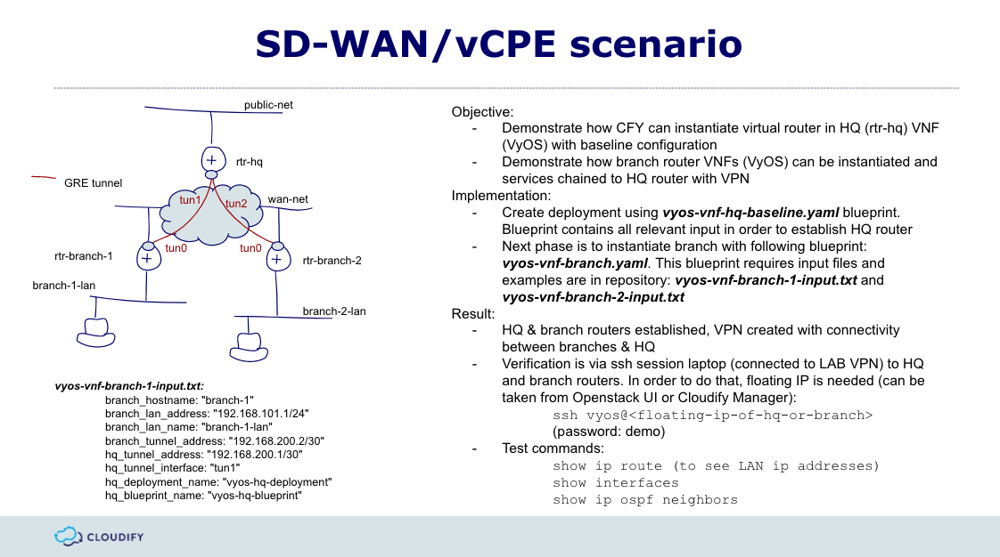

# VyOS simple SD-WAN service blueprint

The purpose of this blueprint is to demonstrate how CFY can instantiate and configure virtual router VNF as part of simple SD-WAN service. In this case we'll use VyOS VNF which is opensource version of Vyatta router. Simple SD-WAN service is based on GRE tunnels which are configured between HQ router and branch routers. 
Plugins used:
* proxy plugin
* terminal plugin
* openstack plugin

Use case requires two blueprints:
* vyos-vnf-hq-baseline.yaml
* vyos-vnf-branch.yaml

...and input files:
* vyos-vnf-branch-1-input.txt
* vyos-vnf-branch-2-input.txt

### vyos-vnf-hq-baseline.yaml
This blueprint uploads VyOS image from AWS S3 and instantiates VM from that image. Image is configured to receive IP address on eth0 from DHCP therefore we're able to access it with CLI. Login credentials:
username: vyos
password: demo
Once VNF is up, then CFY uses terminal plugin to configure VNF with baseline configuration.

### vyos-vnf-branch.yaml
This blueprint is bit more complex. It instantiates branch VNF the same way as it does for HQ however there's a services part in addition to HQ. Services part needs to configure GRE tunnel on branch router and on HQ router. In order to configure it on HQ router we need to use proxy plugin to establish HQ node representation: vyos_vnf_hq_deployment. This node provides runtime informatation as HQ router IP address to terminal plugin. 

### How to use it?
Best is to use CFY Labs with V4 template and use CFY CLI. In a first stage we need baselined HQ VNF:
```sh
cfy install -d vyos-hq-deployment -b vyos-hq-blueprint ./vyos-vnf-hq-baseline.yaml
```
Next phase is to instantiate branches:
```sh
cfy install -d vyos-branch-1-deployment -b vyos-branch-1-blueprint -i vyos-vnf-branch-1-input.txt  ./vyos-vnf-branch.yaml
```
...his can be repeated for the number of branches we need. All is needed is proper input file:
```
branch_hostname: "branch-1"
branch_lan_address: "192.168.101.1/24"
branch_lan_name: "branch-1-lan"
branch_tunnel_address: "192.168.200.2/30"
hq_tunnel_address: "192.168.200.1/30"
hq_tunnel_interface: "tun1"
hq_deployment_name: "vyos-hq-deployment"
hq_blueprint_name: "vyos-hq-blueprint"
```

Once deployment is ready, you can ssh to HQ rotuer or branch (connect to floating IP address which can be obtained from Openstack UI) and issue following commands
```
show interfaces
show ip ospf neighbors
sh ip route
```
If deployment is successfull, then yu should see tunnel interfaces, OSPF neighbors via tunnel interface and LAN network IP's in routing table




